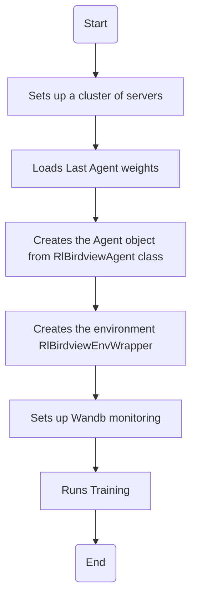

## Overall process

```mermaid
flowchart
   Main(Start) --> S[Sets up a cluster of servers]
   --> A[Loads Last Agent weights]
   --> A2[Creates the Agent object from RlBirdviewAgent class]
   --> E1[Creates the environment RlBirdviewEnvWrapper]
   --> M[Sets up Wandb monitoring]
   --> T[Runs Training]
   --> End(End)

```

## Agent creation process

## Environment creation process