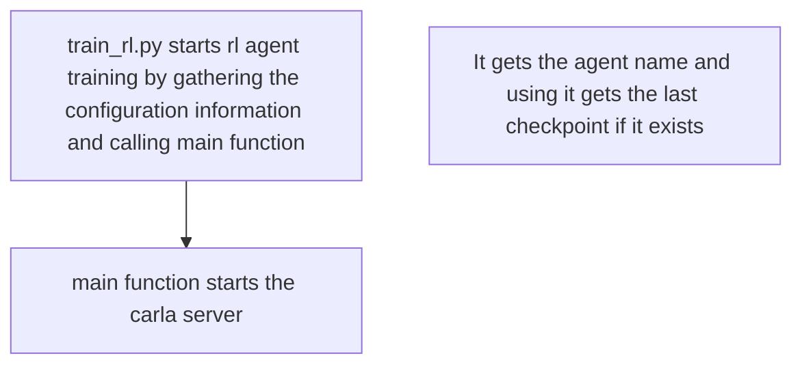

```mermaid
flowchart TD
    A[train_rl.py starts rl agent training by gathering the configuration information and calling main function]
    B[main function starts the carla server]
    C[It gets the agent name and using it gets the last checkpoint if it exists]
    A --> B
```
